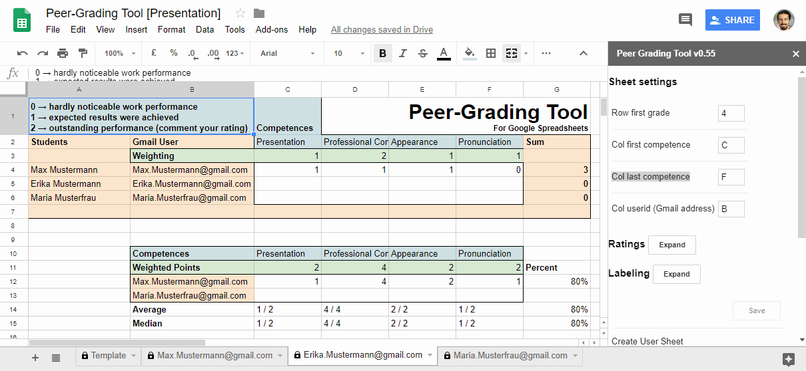

# Peer-Grading Tool for Google Spreadsheets

**Peer-Grading Tool** is a plugin for *Google Spreadsheets*. It is intended for educational use cases where students should grade each other.

All you need are the Gmail Addresses (Google Users) of your students. Then *Peer-Grading Tool* creates a sheet for each student which is protected from other users. There students can rate work of their attendees (e.g. a presentation).

You have several options for configuration of this process. This include:

* **Skills** which are rated
* **Weighting** of every Skill
* **Rating Points** - Min and Max points students can use for Rating

--
_The intention of this animation is a fast overview. For learning how to use this tool, refer to section **Installation**. The email addresses used (datster1@, ...), are placeholders for your students addresses._

# Why do I need this plugin

Teachers should give students the chance to assess work of others. This offers an additional way of learning and reflection process. Also studies show that it can yield gains in the cognitive, social, affective and transferable skill (Topping, 1998). In usual class sizes this is hardly possible because of time limitations. This is where *Peer-Grading Tool* comes into play and helps making it possible.

The process can involve grading and feedback. This tool is focused on making the grading process more efficient. But it can also be used to give peer feedback in addition to grades.

Provided you - the teacher - have a list of Gmail Addresses of your students, you are one klick away to automate this process:

1. One sheet for every student is created - no matter how many they are.
2. For every sheet only the owner of this sheet has the permissions to edit. The edit permissions are restricted to the desired area so that there is no chance to damage something.
3. An evaluation sheet is automatically created, where every student is listed with all ratings and the average of all ratings is automatically calculated.

# Installation

## Basic stuff you only have to do onces

### Get a Google Account

If you really have no Google Account go on reading. Otherwise skip to section "Getting it up and running".

Most people have a Google Account. It is used for Android App Store (Google Play), Android Sync, Gmail, Google Search, Google Drive and many more. If you already have one, it is a good idea to reuse it to avoid confusion.

If you have no Account at all, go to https://accounts.google.com and register (click "Create Account"). If you have logged in, you can go on.

### Create a new Google Spreadsheet

Go to https://drive.google.com and open the folder you want to add the spreadsheet to. Then click "New" - "Google Sheets". There click on "Add-ons" - "Get add-ons". Search now for "Peer-Grading Tool" and install it.

You have to apply for some permissions.

If you have your own template, just copy it and go on.

### Use Peer-Grading tool

For usage manual refer to the [corresponding manual](manual/use_peer-grading-tool.md).

# Tipps

1. Force your students to think about their rating. For example you could want them to give a comment for every rating which is better than the standard rating.

# Permissions

Read here why the script needs following permissions. We will not collect user data!

# Literature

Topping, K., 1998. Peer assessment between students in colleges and universities. Review of educational Research 68, 249–276.

# License
    Peer-Grading Tool for Google Spreadsheets
    Copyright 2018 Stefan Stolz and Nina Margreiter

    Licensed under the Apache License, Version 2.0 (the "License");
    you may not use this file except in compliance with the License.
    You may obtain a copy of the License at

        http://www.apache.org/licenses/LICENSE-2.0

    Unless required by applicable law or agreed to in writing, software
    distributed under the License is distributed on an "AS IS" BASIS,
    WITHOUT WARRANTIES OR CONDITIONS OF ANY KIND, either express or implied.
    See the License for the specific language governing permissions and
    limitations under the License.
