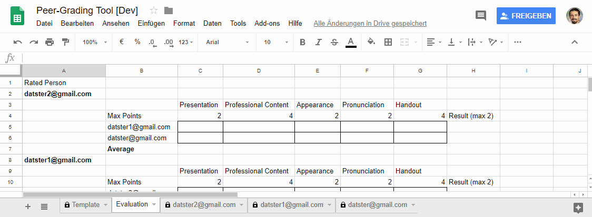
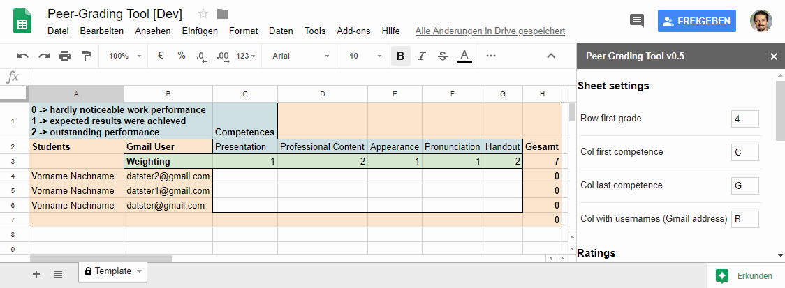

# Peer-Grading Tool for Google Spreadsheets

**Peer-Grading Tool** is a plugin for *Google Spreadsheets*. It is intended for educational use cases where students should grade each other.

All you need are the Gmail Addresses (Google Users) of your students. Then *Peer-Grading Tool* creates a sheet for each stundent which is protected from other users. There students can rate work of their attendees (e.g. a presentation).

You have several options for configuration of this process. This include:

* **Skills** which are rated
* **Weighting** of every Skill
* **Rating Points** - Min and Max points students can use for Rating

# Why do I need this plugin

Teachers should give students the chance to assess work of others. This is an important part of the reflection process. In usual class sizes this is hardly possible because of time limitations. This is where *Peer-Grading Tool* comes into play and helps making it possible.

Provided you - the teacher - have a list of Gmail Addresses of your students, you are one klick away to automate this process:

1. One sheet for every student is created - no matter how many they are.
2. For every sheet only the owner of this sheet has the permissions to edit. The edit permissions are restricted to the desired area so that there is no chance to damage something.
3. An evaluation sheet is automatically created, where every student is listed with all ratings and the average of all ratings is automatically calculated.

# Installation

## Basic stuff you only have to do onces

### Get a Google Account

If you really have no Google Account go on reading. Most people have a Google Account. It is used for Android App Store (Google Play), Android Sync, Gmail, Google Search, Google Drive and many more. If you already have one, it is a good idea to reuse it to avoid confusion.

If you have no Account at all, go to https://accounts.google.com and register (click "Create Account"). If you have logged in, you can go on.

## Getting it up and running

### Create a new Google Spreadsheet

Go to https://drive.google.com and open the folder you want to add the spreadsheet to. Then click "New" - "Google Sheets". There click on "Add-ons" - "Get add-ons". Search now for "Peer-Grading Tool" and install it.

You have to apply for some permissions.

If you have your own template, just copy it and go on.

### Loading Sidebar

Click "Show Sidebar" in the appearing Menu for Peer-Grading Tool.

### Loading template

If you have no existing template, run the script ones, by scrolling down in the sidebar and clicking "Run Sheet Generation". The script will load a template and stop execution.

### Fill in Students

Now you can fill in the Gmail Adresses of the user which should rate each other. The Gmail accounts are needed, so that every student can only edit his document. You will find it helpful if students use Gmail Adresses with their names. If you need more Rows, just add the additional Gmail addresses in the same col.

### Fill in Competences and Weightings

Just Replace the Competences in the Template with the Competences you want to have. Under each Competence you can type in an multiplicator to make the impact of the competence higher.

If you need more competences, add additional columns. But be sure, to adopt "Col last competence" in the sidebar.

### Make the sheet ready for Peer Grading process

Now you only have to click "Run Sheet Generation". This will generate a sheet for every student.

### Share the sheet with your Students

Copy the link in the browser or click "Share" and get the link there. You don't have to change permissions. All is done by the script! Send the link per E-Mail, Google Classroom or similar to your students.

The students have to be logged in with the accounts you filled in the template. If they do so, they can edit the sheet with their name. They are only allowed to set points in the range you set in the sidebar.

# Tipps

1. Force your students to think about their rating. For example you could want them to gife a comment for every rating which is beeter that the standard rating.

# Permissions

Read here why the script needs which permission. The script will collect no user data!

# License
    Peer-Grading Tool for Google Spreadsheets
    Copyright (C) 2018  Stefan Stolz and Nina Margreiter

    This program is free software: you can redistribute it and/or modify
    it under the terms of the GNU General Public License as published by
    the Free Software Foundation, either version 3 of the License, or
    (at your option) any later version.

    This program is distributed in the hope that it will be useful,
    but WITHOUT ANY WARRANTY; without even the implied warranty of
    MERCHANTABILITY or FITNESS FOR A PARTICULAR PURPOSE.  See the
    GNU General Public License for more details.

    You should have received a copy of the GNU General Public License
    along with this program.  If not, see <http://www.gnu.org/licenses/>.
