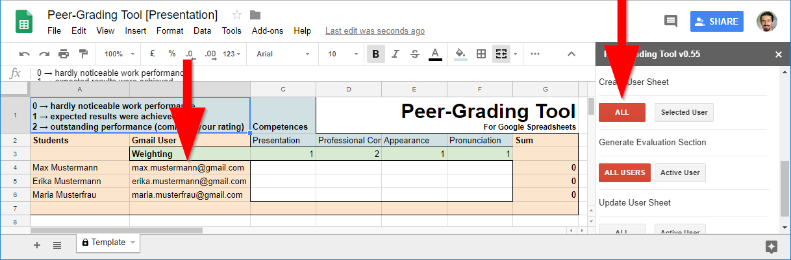
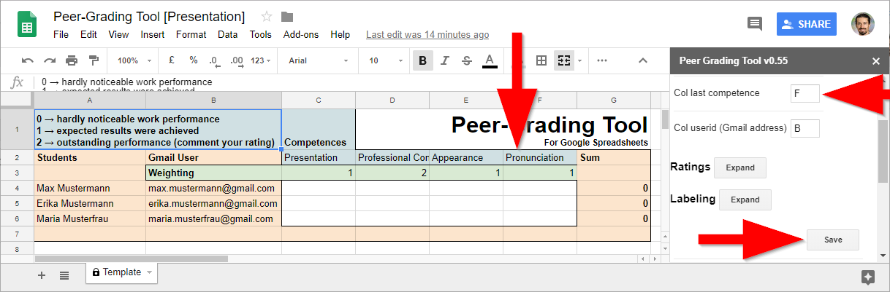

# Starting Point

This manual presumes that you have a Spreadsheet with installed "Peer-Grading Tool" open in your Browser. If you don't know how to do this, refer to the [Readme file](../README.md).

# Short Steps

In section "Detailed Description" the steps are described in detail if you use this tool the first time. What you have to do in most cases are only following steps:

1. Prepare the template sheet by adding the students and competences
2. Adapt "Col last competence" and click "Save" in the sidebar
3. Create user Sheets with the Button "ALL" in the sidebar
4. Create evaluation section with the Button "ALL USERS" in the sidebar
5. Share link to the document with your students

# Detailed Description

## Loading Sidebar

Click "Add-ons" - "Peer-Grading Tool" - "Show Sidebar" in your Spreadsheet.

## Loading template

If you have no existing template, run the script ones, by scrolling down in the sidebar and clicking "Create User Sheet" - "ALL". The script will load a template and stop execution.

## Fill in Students

In the appearing Template sheet you can fill in the Gmail adresses of the users which should rate each other. The Gmail accounts are needed, so that every student can only edit in the region he is allowd to. You will find it helpful if students use Gmail Adresses with their names. If you need more rows, just add the additional Gmail addresses in the same col.

--
_Example showing default template file filled out with three students_

## Fill in Competences and Weightings

Just replace the competences in the Template with the competences you want to. Under each competence you can type in a weighting factor to make the impact of the competence higher.

If you need more competences, add additional columns. But be sure to adopt "Col last competence" in the sidebar.

--
_Example showing steps needed to adopt number of competences_

## Make ready for Peer Grading process

Now you have to click "Create User Sheet" - "ALL". This will generate a sheet for every individual student where he can rate each other student. If this process is stopping before all sheets are generated (can happen with a lot of students), you can generate the rest per user. Just klick on the desired Gmail adress and then "Selected User".

To generate the evaluation section for every user, just klick "Generate Evaluation Section" - "ALL USERS". If this process is stopping somewhere, open the desired user sheet and klick "Active User".

## Update User sheets

You can use the buttons in the "Update User Sheet" section if you have changed something in the template which should be updated in user sheets.

## Share the sheet with your Students

Copy the link in the browser or click "Share" and get the link there. You don't have to change permissions. All is done by the script! Send the link per e-mail, Google Classroom or similar to your students.

The students have to be logged in with the accounts which you filled in in the template-sheet. If they do so, they can edit the sheet with their username. They are only allowed to set points in the range which you defined in the sidebar.
